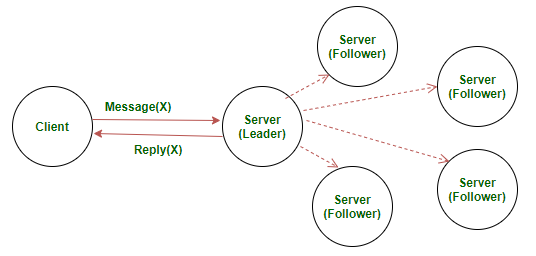

# LogReplication ToDo

## Connect to a randomly chosen server
- If that server is not the leader, it should receive the leader address back
  - this means that at all times the followers must know who the leader is 
    - this is made via the server address sent on the AppendEntry (in our case we only need to send the ServerId - line on the file)
-If there's no response from a server it times out and chooses another randomly choosen	server
-If a server receives the same operation uid (sent on the client request) and it sees it already exists on its logs. The server doesn't re-exeecute the command, it only responds with the value.

## Server side (handle the client requests)	

-Appends the client command to the log (as an entry)
-Issues AppendEntries to all followers for replication
-When it has been safely replicated, it returns the result of the execution to the client
-If a a follower crashes, the leader retries indefinetily (even if the leader has already responded to the client) -> *This implies a concurrent process; separate thread*
 - it stops trying once all followers replicated the entries on its log (*ends thread*)
-The LOG has entries with the following on each -> term; operation code (action from the client) 
-Only executes the state machine when it has commited its entry	
-A log entry is commited once the leader has replicated it on a majority of servers
 -this also commits previous entries on its logs, including entries created by other leaders
-The leader keeps track of the highest index it knows it has been commited
 - it includes this index on future AppendEntries
   - including heartbeats
		
-!! Once a follower learns that a entry has been commited (on the leader), it applies the entry to its state machine
-When sending AppendEntries, the leader sends its term and index.
 -if a follower doesn't find this term and index in its log, it rejects new entries
-If consistency check fails (the point mentioned before), confliting entries will be overwritten with entries from the leade's log
 -(1) The leader must find the last log where two agree
 -(2) Delete all entries from that point foward (on the follower)
 -(3) Send the follower all the entries after the point they both agree
	
-The leader mantains a nextIndex for each follower	
 - Which is the index of the next log entry the leader will send to that follower
 - When a leader comes to power, it initializes all nextIndex values to the index just after the last one in its log
	
-If the consistency check fails, it will decrease the nextIndex and retry the AppendEntry
 - eventually they will match
 - removes confliting entries from followers
   -appends new entries to follower log from leader (if any)
	-!! When consistency is reached it will remain like this till the end of the term (is guaranteed by RAFT)

# TFD-RAFT_Protocol

What is Raft consensus algorithm?

In a distributed system, data replication is needed for either fault-tolerance or latency optimization. Maintaining a consensus among all replications is crucial for the correctness and robustness of the distributed system. Various algorithms emerge to address this problem. Raft is an alternative designed to Paxos, aiming to be more understandable and to offer the same level of safety and robustness.

Raft employs a leader approach where there is one and only one elected leader node, with the rest of nodes in a follower state. Log replication across the system is managed by the leader node. Leadership continues until it fails or disconnects, and a new leader is elected in such case.

Leader Election

The election starts when the current leader fails/disconnects or at the beginning of the algorithm. A new term starts in the system with a random period for the new leader to be elected. If the election successes with a single new leader winning, the term carries on and the new leader takes over to coordinate the normal operations. Otherwise, the term expires to yield another round of the election.

An election is started with one or more node assumes candidacy, which is the result of not receiving any communication from the leader over a certain amount of timeout. Timeout is randomized to minimize the impact of the split vote. Each Server vote once per term, on a first-come-first-served basis. Candidate votes for itself and request voting to other nodes. If a candidate receives a request from another candidate with a higher term, it will update its term and vote positively to that request, otherwise, if the request is from a lower or equal term candidate, the received request will be discarded. When the majority votes for a candidate, that candidate wins the election.

Log Replication

Log replication is managed by the leader. Clients requests are handled by the leader, which consist of a command to be executed by the replicated state machines in the system. The leader first logs this locally and spreads the messages to all the follower about the updated entry. Followers log the updates in the message, and feedback to the leader as a consent to the update. Once the majority consents to the update, the leader will then "commit" this transaction to its local state machine and respond to the Client about the success. Messages to inform all the followers to commit their replicates are sent at the meantime. The "commit" actions to transact all the previous staged logs if any was left undone.

Logs could be inconsistent in the case of leader crash, where some previous logs are not fully replicated to all its followers. In such cases, the new leader will request the followers to update their logs to reach consensus with the leader's state.
